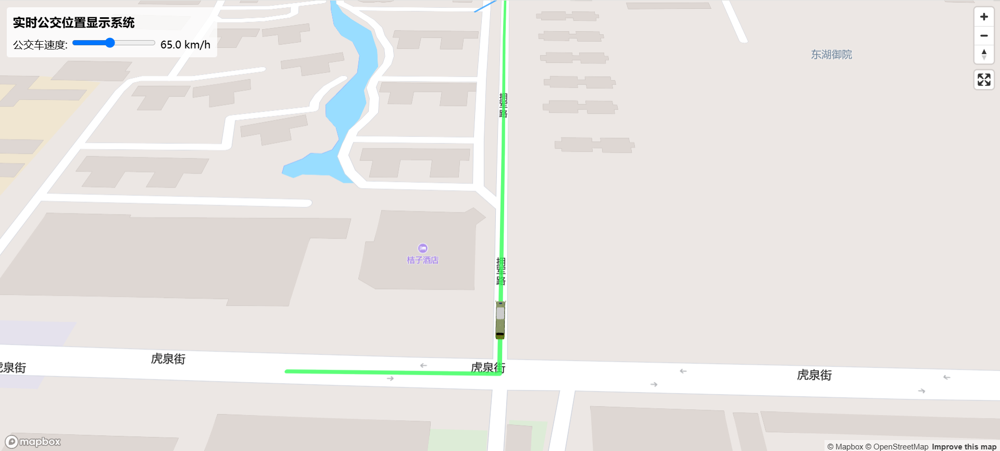

# 实时公交位置显示系统

一个基于WebGIS的实时公交车位置显示系统，使用3D模型在地图上展示公交车沿路线行驶的情况。

## 项目概述

本系统利用Mapbox GL JS和Three.js技术，在地图上实时显示公交车的位置和行驶路线。系统具有以下特点：

- 在地图上显示多条公交路线，每条路线使用不同颜色标识
- 加载3D公交车模型，并使其沿着指定路线行驶
- 公交车到达终点后自动调转车头，往返运行
- 支持调整公交车行驶速度
- 点击公交车模型可显示弹窗，查看公交车详细信息

## 技术栈

- **Mapbox GL JS**: 提供地图显示和交互功能
- **Three.js**: 用于加载和渲染3D公交车模型
- **Turf.js**: 提供地理空间分析功能
- **原生JavaScript**: 实现业务逻辑和动画效果

## 功能特性

### 公交路线显示

系统可以在地图上显示多条公交路线，每条路线使用不同颜色进行标识，便于用户区分不同的公交线路。

### 3D公交车模型

系统使用Three.js加载3D公交车模型，并将其准确放置在地图上的公交路线上。公交车模型会根据路线方向自动调整朝向，确保车头始终朝向行驶方向。

### 实时位置更新

公交车模型会沿着路线实时移动，模拟真实公交车的运行情况。系统使用动画循环不断更新公交车的位置，确保平滑的视觉效果。

### 自动调头功能

当公交车到达路线终点时，系统会自动将车辆调头，并沿原路线返回，实现往返运行的效果。

### 速度控制

用户可以通过界面上的滑块控制公交车的行驶速度，范围从30km/h到100km/h，满足不同的演示需求。

### 信息弹窗

点击公交车模型时，系统会显示一个弹窗，展示该公交车的详细信息，如线路名称、当前速度、行驶方向等。

## 系统架构

系统主要由以下几个模块组成：

- **地图模块**: 负责地图的初始化、显示和交互
- **路线模块**: 管理公交路线的加载和显示
- **公交车控制模块**: 控制公交车模型的加载、位置更新和方向调整
- **模型加载模块**: 负责3D模型的加载和渲染
- **用户界面模块**: 提供用户交互界面，如速度控制滑块

## 键盘快捷键

系统提供了一些键盘快捷键用于调试和测试：

- **R键**: 旋转所有公交车模型180度
- **F键**: 翻转所有公交车的行驶方向
- **Z键**: 重置所有公交车模型的旋转偏移量
- **D键**: 在控制台显示所有公交车的状态信息

## 未来计划

- 接入真实公交API数据，显示实际公交车位置
- 添加公交站点信息和到站预测
- 优化移动设备上的性能和用户体验
- 增加更多公交线路和车辆类型
- 实现夜间模式和不同天气条件下的视觉效果

## 截图

